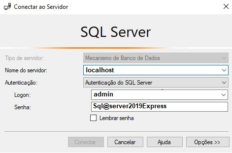

# Passo a Passo - Windows 10/11

> **Instalação do Docker Desktop para Windows**  
Download e instalação: https://www.docker.com/products/docker-desktop/.

> **CMD - Prompt de Comando do Windows PowerShell**  
Clonar o repositório, acessar o diretório `PGD-Docker`, e verificar o conteúdo.
```console
git clone --progress -v "https://github.com/erivandosena/Sistema_Programa_de_Gestao_Susep.git" "PGD-Docker"

cd .\PGD-Docker\

dir
```
```
Diretório: C:\Users\Usuario\PGD-Docker

Mode                 LastWriteTime         Length Name
----                 -------------         ------ ----
d-----        29/09/2022     11:21                pgd-susep
d-----        29/09/2022     11:21                proxy
d-----        29/09/2022     11:21                sqlserver
d-----        29/09/2022     11:21                stacks
-a----        29/09/2022     11:21           8382 .gitignore
-a----        29/09/2022     11:21           1158 LICENSE
-a----        29/09/2022     11:21           4175 PassoAPasso-Windows.md
-a----        29/09/2022     11:21           4766 README.md
```
> **Editar o arquivo hosts**  
```console
start -verb runas notepad C:\Windows\System32\drivers\etc\hosts
```
Adicionar as linhas abaixo e salvar o arquivo.
```
# PGD locais
127.0.0.1       pgd.localhost
127.0.0.1       pgd.localhost.staging
127.0.0.1       pgd.localhost.treinamento
127.0.0.1       traefik.localhost.dashboard
```
> **Build da Imagem PGD**  
Criar e taguear a imagem do PDG - Programa de Gestão e Desempenho e verificar os níveis de vulnerabilidades na imagem.  
Observação: Substituir "**erivando**"/pdg-susep-ubuntu20:latest por seu nome de conta no Docker Hub.
```console
docker build -f .\pgd-susep\Dockerfile -t erivando/pdg-susep-ubuntu20:latest .\pgd-susep\

docker scan --file .\pgd-susep\Dockerfile erivando/pdg-susep-ubuntu20:latest
```
> **Build da Imagem MSSQLSERVER**  
Criar e taguear a imagem do SqlServerExpress e verificar os níveis de vulnerabilidades na imagem.
```console
docker build -f .\sqlserver\Dockerfile -t erivando/mssqlserverexpress-2019-ubuntu20:latest .\sqlserver\

docker scan --file .\sqlserver\Dockerfile erivando/mssqlserverexpress-2019-ubuntu20:latest
```
> **Container Traefik**  
Rodar o container do Traefik
```console
docker-compose -f .\proxy\docker-compose.yml up -d
```
> **Container SQLServer**  
Rodar o container do SQLServer Express
```console
docker-compose -f .\sqlserver\docker-compose.yml up -d
```

> **Containers PGD - Susep**  
Rodar os containers da stack PGD e verificar se os STATUS dos 11 containers estão `running` conforme exemplo abaixo.
```console
docker-compose -p pgd-staging -f .\stacks\docker-compose.staging.yml up -d
docker-compose -p pgd-train -f .\stacks\docker-compose.treinamento.yml up -d
docker-compose -p pgd-prod -f .\stacks\docker-compose.producao.yml up -d
```
```
PS C:\Users\Usuario\PGD-Docker> docker-compose ls
NAME                STATUS              CONFIG FILES
pgd-prod            running(3)          C:\Users\Usuario\PGD-Docker\stacks\docker-compose.producao.yml
pgd-staging         running(3)          C:\Users\Usuario\PGD-Docker\stacks\docker-compose.staging.yml
pgd-train           running(3)          C:\Users\Usuario\PGD-Docker\stacks\docker-compose.treinamento.yml
proxy               running(1)          C:\Users\Usuario\PGD-Docker\proxy\docker-compose.yml
sqlserver           running(1)          C:\Users\Usuario\PGD-Docker\sqlserver\docker-compose.yml
```

> **Bancos de Dados**  
Realizar a conexão com o servidor `MSqlServer` através do `Microsoft SQL Server Management Studio` e verificar se os bancos `pgd_susep`, `pgd_staging` e `pgd_train` foram criados e suas tabelas.  

Informar os dados do logon confome imagem



> **Acessar o Browser**  
Se tudo ocorreu bem, após alguns minutos os serviços estarão disponíveis conforme URLs abaixo:

http://pgd.localhost.staging/  
http://pgd.localhost.treinamento/  
http://pgd.localhost/  

> **Acesso de Teste**  
Usuário: *sisgp_gestor*  
         *sisgp_cg*  
         *sisgp_coordenador*  
         *sisgp_diretor*  
         *sisgp_servidor*  
Senha: *qualquer caractere*

> **Traefik**  
http://traefik.localhost.dashboard:8080/

##### Contribuições  
Sugestões de possíveis melhorias neste readme são bem vindas.
