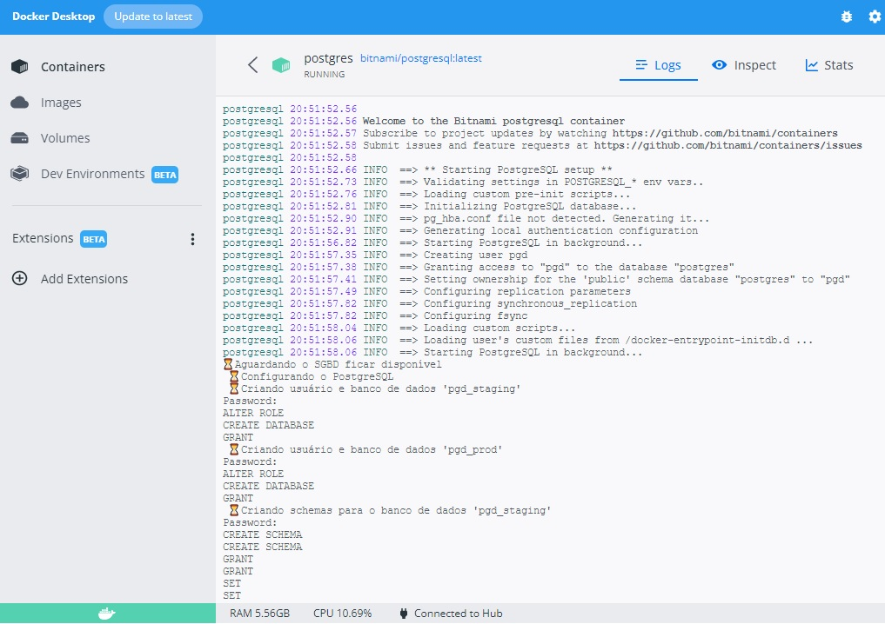
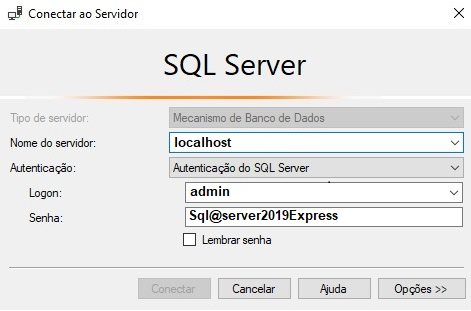
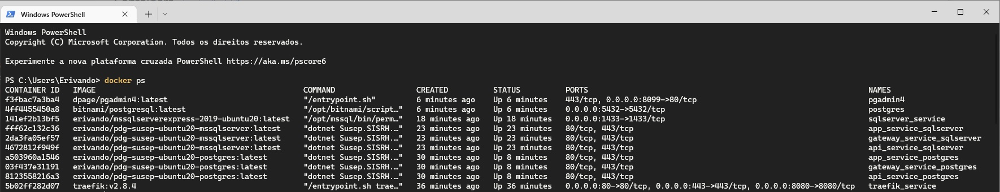
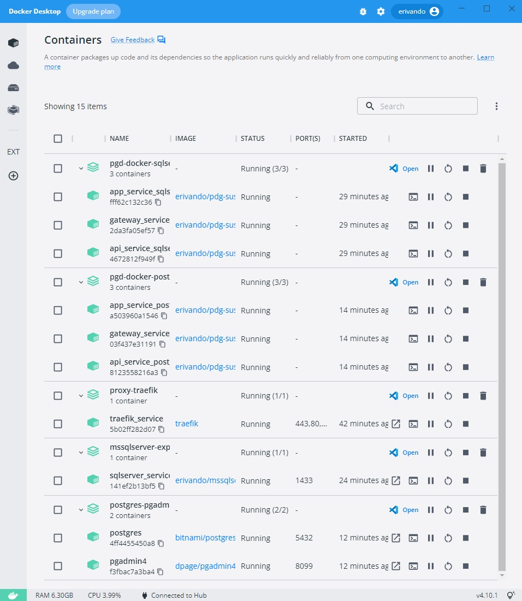

# PGD/SUSEP - Docker

**Versão atual:** 1.7 (com adaptações a partir do código da branch "main" em https://github.com/spbgovbr/Sistema_Programa_de_Gestao_Susep)

#### Requisitos do ambiente para o build e deploy dos serviços

**Em Linux (Ubuntu/Debian):**  
Docker  
Docker-compose v1 e/ou v2  
Kubernetes  
HAProxy Kubernetes Ingress Controller  

**Em Windows:**  
WSL/2 (Ubuntu/Debian)  
Docker   
Docker-compose v1 e/ou v2  
Kubernetes (Minikube, K3s, etc)  
HAProxy Kubernetes Ingress Controller  

##### Nota
Os dados informados na implementação relacionados a nomes de domínios, certificados, usuário, senhas, etc. São meramente didáticos e tais informações sensíveis devem ser  adaptadas a sua realidade de ambiente e infraestrutura.  

Não fez parte do escopo desta instrução ferramenta de orquestração para automatização da implantação,  gerenciamento, escala e rede dos containers.  

Para execução desta implementação em ambintes de homologação e/ou produção é necesário ajustar os volumes dos containers conforme infraestrutura de Storages On-premises ou em Cloud.

# Implementação da infraestrutura

> Os passos seguintes poderão ser aplicados tanto em Windows quanto em Linux.

### Observações
Para uma experiência completa do ambiente apresentado, faz necessário alguns ajustes em sua máquina local antes de iniciar os containers, **deste ponto em diante, para questões de facilidade, será levado em consideração o sistema operacional Windows, mas nada impede que seja realizado no Linux por exemplo, WSL/2**:

> CMD - Prompt de Comando do **Windows PowerShell**

- No Windows editar o arquivo hosts em **`C:\Windows\System32\drivers\etc\hosts`**
- No Linux editar o arquivo hosts em **`/etc/hosts`** 

> **Edite o arquivo hosts (para Windows)**  
```console
start -verb runas notepad C:\Windows\System32\drivers\etc\hosts
```
```console
# PGD locais
127.0.0.1       pgd.localhost.psql  
127.0.0.1       pgd.localhost.mssql  
127.0.0.1       traefik.localhost 
```
- Se preferir, no WSL/2 (Subsistema Windows para Linux) faça:  
- `sudo ln -s /mnt/c/Windows/System32/drivers/etc/hosts /etc/hosts` 
  e edite o arquivo hosts pelo Windows.  

1 - Fazer download ou clonar este repositório e acessar o diretório **`PGD-Docker`**.
```console
git clone --progress -v "https://github.com/erivandosena/Sistema_Programa_de_Gestao_Susep.git" "PGD-Docker"
```
```
cd \PGD-Docker
```


Traefik com configuração de roteamento dinâmico e configuração de inicialização estática. *Fonte imagem, doc.traefik.io*

2 - Acessar o diretório **/Proxy-TRAEFIK**, e provisione o container do Proxy com   
`$> docker-compose up -d`   
Logs  
`$> type /logs/traefik.log`


3 - Para **PGD com Postgres**, acessar o diretório **`/Build-PGD_Docker_PostgreSQL`**, construir a imagem do pgd para Postgres.   
`$> docker build -f ./Dockerfile -t erivando/pdg-susep-ubuntu20-postgres:latest ./src/`   
`$> docker push SEU-USER/pdg-susep-ubuntu20-postgres:latest` (opcional)   

3.1 - E provisionar também o container para o PostgreSQL e pgAdmin 4 (Para Administração de databases postgres).  
`$> docker compose -p postgres-pgadmin -f docker-compose.yml up -d`  

*Uma dica é acompanhar os logs da criação do banco de dados, para verificar se tudo ocorreu como esperado.*



4 - Para **PGD com SqlServer**, acessar o diretório **`/Build-PGD_Docker_MicrosoftSQLServer`**, construir a imagem do pgd para SqlServer.   
`$> docker build -f ./Dockerfile -t erivando/pdg-susep-ubuntu20-mssqlserver:latest ./src/`  
`$> docker push SEU-USER/pdg-susep-ubuntu20-mssqlserver:latest` (opcional)  

4.1 - E provisionar também o container do SQLServer.   
`$> docker compose -p mssqlserver-express -f docker-compose.yml up -d`  

##### Nota adicional
O acesso administrativo do bancos de dados do SqlServer é padrão através do **Microsoft SQL Server Management Studio**  
*Baixar o SQL Server Management Studio (SSMS)*: https://aka.ms/ssmsfullsetup

Acesso:  
**Autenticação do SQL Server**;  
**Usuário** `admin`;  
**Senha** `Sql@server2019Express`  
**Servidor** `localhost` ou IP  

Informar os dados do logon no SSMS confome imagem:  
  

Endereço do host (estação de trabalho) onde está subindo os serviços, se usar WSL é o endereço `eth0` obtido com o comando `ip route`.  


5 - Acessar o diretório **`/Deploy-PGD_DockerCompose`**, e provisionar o(s) container(s) PGD conforme necessidade.
- **Para PGD da versão com banco de dados PostgreSQL**  
`$> docker compose -p pgd-docker-postgres -f docker-compose.postgres.yml up -d`  

- Logs:   
`$> type .\logs\api\log_pgd_postgres.log`  
`$> type .\logs\gateway\log_pgd_postgres.log`  

- **Para PGD da versão com banco de dados MS SqlServer Express**  
`$> docker compose -p pgd-docker-sqlserver -f docker-compose.mssqlserver.yml up -d`  

- Logs:   
`$> type .\logs\api\log_pgd_mssqlserver.log`  
`$> type .\logs\gateway\log_pgd_mssqlserver.log`  

> Após os passos acima verifique se todos os containers de seu interesse estão **Up** parecidos com as imagens abaixo:

**Prompt de Comando**:  

Ou  
**Docker Decktop**:  
  

6 - Após isso as aplicações estarão disponíveis no host conforme protocolo/domain.  
Ex.: *http://pgd.localhost.psql/*  
Ex.: *http://pgd.localhost.mssql/*  

> **Acesso demo**  
- Usuário:  
*sisgp_gestor*  
*sisgp_cg*  
*sisgp_coordenador*  
*sisgp_diretor*  
*sisgp_servidor*  
- Senha:  
*qualquer caractere*

> **Traefik**  
http://traefik.localhost:8080/dashboard/  
Usuario: test  
Senha: test  

> **pgAdmin 4**  
http://localhost:8099/  
Usuario: admin@admin.com  
Senha: admin1234  

> pgAdmin 4 (Servers) **Databases PGD PostgresSQL**
Password: postgres  


##### Deployments YAML para provisionamento do PGD com o RDBMS PostgreSQL no Kubernetes

Acessar o diretório **`/Deploy-PGD_Kubernetes_HAProxy`**

`$> kubectl apply -f pgd-postgres-deployment.yml`   
`$> kubectl apply -f postgres-deployment.yml`  
`$> kubectl apply -f pgadmin-deployment.yml`  

#### HAProxy Kubernetes Ingress Controller  
```console
kubectl apply -f https://raw.githubusercontent.com/haproxytech/kubernetes-ingress/master/deploy/haproxy-ingress.yaml

```
